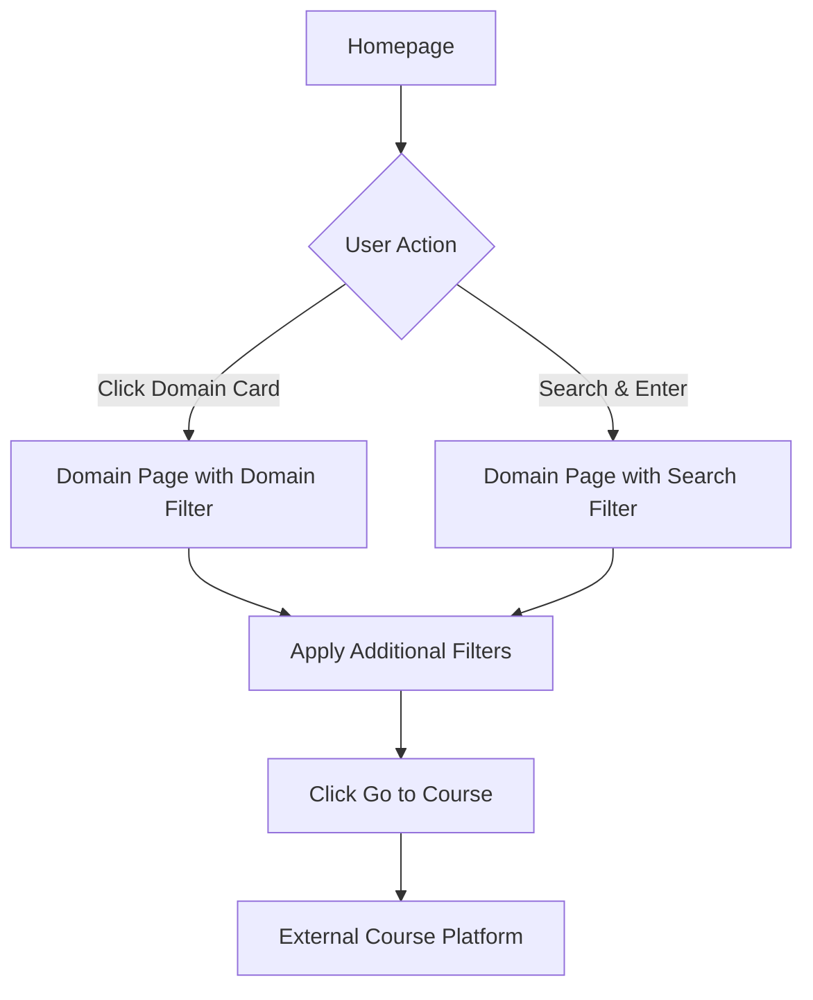

## 1. Product Overview
MaAaNn skillsphere is a responsive static website that aggregates free online courses from various platforms and redirects users to the official course pages. It serves as a centralized discovery platform for learners seeking free educational resources across multiple domains.

The platform solves the problem of scattered free courses across different platforms by providing a single, searchable interface. Students and lifelong learners can discover courses in Technology, Commerce, Arts & Humanities, Science, and Design & Creativity domains without needing to visit multiple websites.

## 2. Core Features

### 2.1 User Roles
No user registration or authentication required. All features are publicly accessible to any visitor.

### 2.2 Feature Module
The website consists of the following main pages:
1. **Homepage** - Main landing page with search functionality and domain navigation
2. **Domain Page** - Course listing page with filtering capabilities for specific domains

### 2.3 Page Details

| Page Name | Module Name | Feature description |
|-----------|-------------|---------------------|
| Homepage | Navigation Bar | Display project name "MaAaNn skillsphere" with tagline and dark mode toggle |
| Homepage | Search Bar | Large search input for course/skill discovery with Enter key functionality |
| Homepage | Domain Cards | Grid layout showing Technology, Commerce, Arts & Humanities, Science, Design & Creativity cards |
| Homepage | Featured Courses | Section displaying sample course cards from courses.json |
| Domain Page | Dynamic Header | Show domain-specific heading based on URL parameter |
| Domain Page | Filter Panel | Left sidebar with Level, Duration dropdowns and Certificate checkbox |
| Domain Page | Course Grid | Right side displaying filtered course cards with platform badges and "Go to Course" buttons |
| Domain Page | Search Results | Display filtered courses when search parameter is present |

## 3. Core Process

### User Navigation Flow
1. User lands on homepage and sees domain cards
2. User can either search for specific skills/courses or click a domain card
3. Clicking domain card navigates to domain.html with domain parameter
4. On domain page, user can apply filters (level, duration, certificate)
5. User clicks "Go to Course" button to open course URL in new tab

### Search Flow
1. User types in homepage search bar and presses Enter
2. System redirects to domain.html with search parameter
3. Domain page filters courses across all domains matching the search term

## 4. User Interface Design

### 4.1 Design Style
- **Primary Colors**: Clean white background with blue accent colors for CTAs
- **Secondary Colors**: Light gray for cards, dark gray for text
- **Button Style**: Rounded corners with hover effects
- **Font**: Modern sans-serif (system fonts), 16px base size
- **Layout**: Card-based design with consistent spacing
- **Icons**: Minimalist approach, platform logos where applicable

### 4.2 Page Design Overview

| Page Name | Module Name | UI Elements |
|-----------|-------------|-------------|
| Homepage | Navigation | Dark mode toggle switch, centered branding |
| Homepage | Search Bar | Full-width input with placeholder text, prominent positioning |
| Homepage | Domain Cards | Equal-sized cards with domain icons, hover elevation effect |
| Homepage | Featured Courses | Horizontal scroll or grid layout with course cards |
| Domain Page | Filter Panel | Stacked dropdowns and checkbox, clean spacing |
| Domain Page | Course Cards | Platform badges, duration tags, certificate indicators |

### 4.3 Responsiveness
- Desktop-first approach with mobile adaptation
- Responsive grid layouts that stack on mobile
- Touch-friendly buttons and cards
- Collapsible navigation for smaller screens