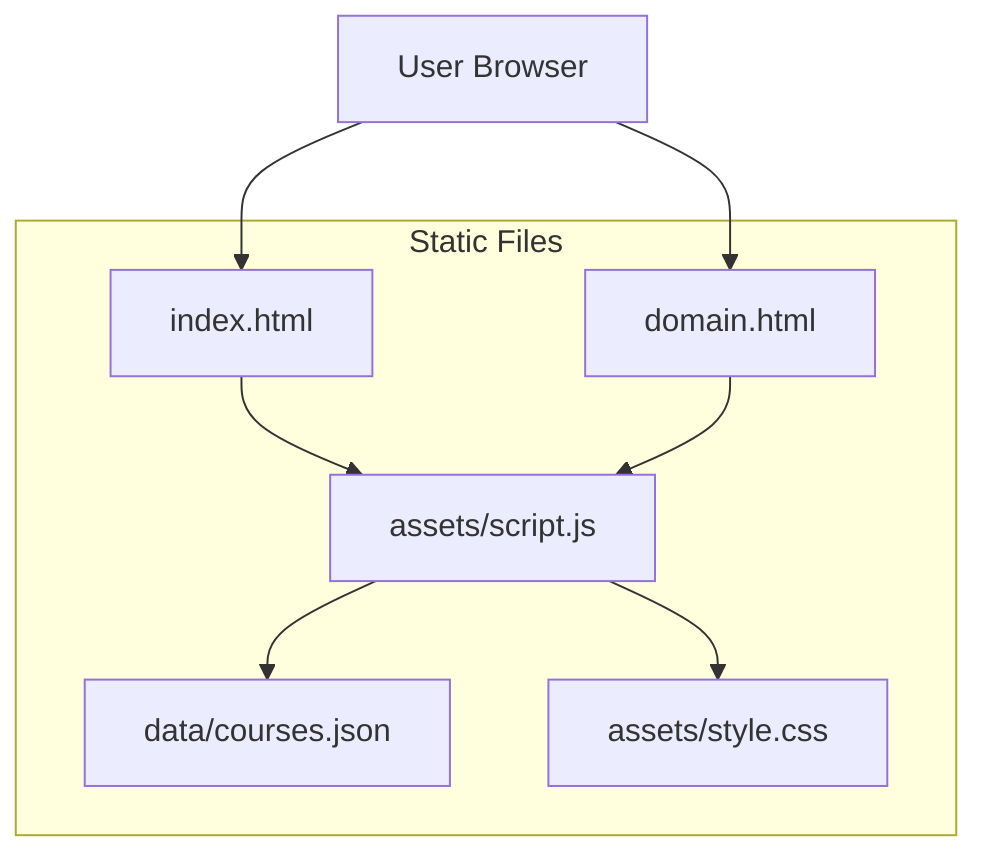

## 1. Architecture Design



## 2. Technology Description

- **Frontend**: Vanilla HTML5, CSS3, JavaScript ES6+
- **Data Storage**: JSON file (data/courses.json)
- **Deployment**: GitHub Pages (static hosting)
- **External Dependencies**: None (pure client-side implementation)

## 3. Route Definitions

| Route | Purpose |
|-------|---------|
| /index.html | Homepage with search and domain navigation |
| /domain.html | Course listing page with filtering capabilities |

Note: Routes are relative paths for GitHub Pages compatibility

## 4. File Structure

```
maaan-skillsphere/
├── index.html
├── domain.html
├── assets/
│   ├── style.css
│   └── script.js
└── data/
    └── courses.json
```

## 5. Data Model

### 5.1 Course Object Structure
```json
{
  "id": 1,
  "course_name": "Python for Everybody",
  "domain": "Technology",
  "subdomain": "Programming",
  "platform": "Coursera",
  "level": "Beginner",
  "duration": "20 hours",
  "certificate": true,
  "language": "English",
  "url": "https://example.com",
  "last_verified": "2025-11-01"
}
```

### 5.2 courses.json Structure
```json
[
  {
    "id": 1,
    "course_name": "Python for Everybody",
    "domain": "Technology",
    "subdomain": "Programming",
    "platform": "Coursera",
    "level": "Beginner",
    "duration": "20 hours",
    "certificate": true,
    "language": "English",
    "url": "https://coursera.org/learn/python",
    "last_verified": "2025-11-01"
  },
  // ... 25-30 total courses
]
```

## 6. JavaScript Implementation Details

### 6.1 Core Functions
- `fetchCourses()`: Load courses from data/courses.json
- `filterByDomain(courses, domain)`: Filter courses by domain
- `filterBySearch(courses, searchTerm)`: Filter courses by search term
- `applyFilters(courses, level, duration, certificate)`: Apply all active filters
- `renderCourseCard(course)`: Generate HTML for course card
- `toggleDarkMode()`: Handle dark mode switching

### 6.2 URL Parameter Handling
- Read `domain` parameter for domain-specific filtering
- Read `search` parameter for search-based filtering
- Support both parameters simultaneously

### 6.3 Filter Logic
- Level: Exact match (Beginner/Intermediate/Advanced)
- Duration: Parse duration string and apply range logic
- Certificate: Boolean filter (true only if checked)
- Search: Case-insensitive matching in course_name and subdomain

## 7. CSS Implementation

### 7.1 Responsive Grid System
- Mobile: Single column layout
- Tablet: 2-column grid
- Desktop: 3-4 column grid

### 7.2 Dark Mode Implementation
- `.dark` class applied to body element
- CSS custom properties for color variables
- Smooth transitions for theme switching

### 7.3 Component Styles
- Card components with hover effects
- Button styles with platform-specific colors
- Filter panel with consistent spacing
- Search bar with focus states

## 8. Deployment Considerations

### 8.1 GitHub Pages Configuration
- All paths must be relative
- No absolute URLs to ensure subpath compatibility
- Static file serving from repository

### 8.2 Performance Optimization
- Minimal JavaScript bundle size
- CSS minification recommended
- JSON data caching in browser
- Lazy loading for course cards (optional)

### 8.3 Browser Compatibility
- Modern browser support (ES6+)
- Fetch API polyfill for older browsers (if needed)
- CSS Grid and Flexbox support